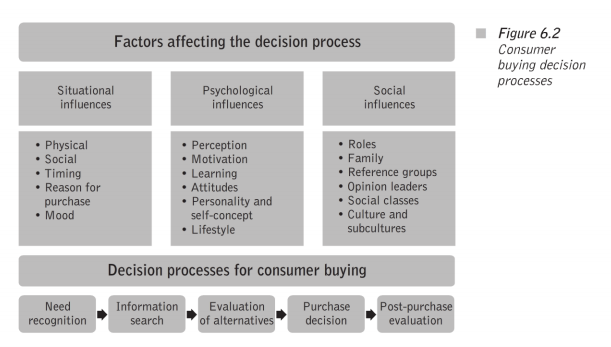

# Analysis of the consumer buying decision process
*OMT 503 - Big Reflection Paper #4*
*Based on the excerpt below, Crane chapter 3-4 and all other course resources:*

Excerpt from *Entrepreneurship Marketing*, by Sonny Nwankwo and Tunji Gbadamosi:
> In understanding the buying decision process you may like to take a few minutes to ask the man or woman next to you in class if he or she prefers to shop for fruit and vegetables at farmers’ markets (open markets) rather than at supermarkets such as Tesco or Sainsbury’s, the key players in the UK. You may also be wondering why there seem to be longer queues at mobile phone kiosks in "China Town" at London’s Soho or East London than there are at dedicated mobile phone shops such as T- Mobile, Vodafone, and Carphone Warehouse. Perhaps it may be connected to the fact that there may be more leeway for haggling, little or no hassle of credit checks for mobile phone contracts, options to purchase refurbished handsets, free unlocking as a product bundle, or many other benefits that can be derived from the small-time players. Now let’s see what the literature has to say about the factors that affect buying decisions and the prescribed processes involved in reaching such decisions.

> The consumer buying decision process is a five- stage purchase decision process (see Figure 6.2) that includes problem recognition, information search, evaluation of alternatives, purchase, and post- purchase evaluation. But some points must be mentioned:
- the actual act of purchase is only one stage that comes late in the process
- not all decision processes, once initiated, lead to an ultimate purchase (the individual may terminate the process at any stage)
- not all consumer buying decisions include all five stages.

---
### Need recognition (Stage 1):
Need recognition is simply the difference between a desired state and actual condition (i.e. becoming aware of a need for a particular product). Note that marketers may use sales personnel, advertising, and packaging to trigger recognition of needs or problems. For example, advertisements suggesting that you might have a mouth ulcer can be seen in the marketing of Bonjela! Recognition speed can also be slow or fast. For example, responding to an advertisement about the need for life insurance may take longer than responding to one advocating a new type of shampoo that prevents split ends.

### Information search (Stage 2):
After the consumer becomes aware of the problem or need, he or she searches for information about products that will help resolve the problem or satisfy the need. There are two broad types of information search—Internal and External.

- **Internal search:** this is an information search situation in which buyers search their memories for information about their products that might solve their problem. For example, you might want to recall that the last time you went on holiday to the seaside resort of Blackpool you enjoyed the sunscreen that you purchased in an independent health and beauty shop rather than at The Body Shop in London.
- **External search:** this is an information search in which buyers seek information from sources other than memory (friends, relatives, public sources, marketing sources such as advertising, package labeling, and in-store displays).

### Evaluation of alternatives (Stage 3)
A successful information search yields a consideration (evoked) set of products or a group of brands that the buyer views as possible alternatives. At this third stage of the decision process, the consumer establishes a set of evaluative criteria against which to compare the characteristics of the products in the consideration set. For example, this could be in terms of price, how natural the sunscreen ingredients may be, the packaging and labeling of the sunscreen, and so on.

The consumer rates and eventually ranks the brands in the consideration set by using the criteria and their relative importance. Marketers can influence consumers’ evaluation by framing the alternatives—that is, by the manner in which they describe the alternatives and their attributes. A typical example in this case could be your Anadin Extra (an over-the-counter painkiller) which promises to take away that headache even faster than the regular version you may have been used to. Another example could be the ‘2in1’ promise on most shampoo labels—fighting dandruff at the same time as conditioning the hair.

### Purchase Decision (Stage 4)
At the purchase stage, the consumer selects the product or brand to be purchased. It is also at this stage that the actual purchase is made (unless the process has been terminated earlier). The decision to purchase, however, would depend on a number of factors, including:
- product availability
- seller choice
- terms of sale

All of these factors may influence the final product selection. Sometimes they may all need to be present for the purchase to occur. For example, a desired product needs to be in stock (or at least easy to order) when needed; purchase might also be tied to the purchase of another product such as soaps with natural extracts or other beach or tanning accessories for the “serial” holidaymaker. Another option would be package deals which provide you with the popular high-street slogan of BOGOF (buy one, get one free)—for example, by throwing in free shuttle bus services, discounts on hotels, cinemas, and car hire all for purchasing an airline ticket at the right time. And if you were traveling to Atlantic City (the East Coast version of Las Vegas) from New York you just might get your first game on the house for getting on the Greyhound (the coach service similar to the National Express in the UK).

### Post-purchase evaluation (Stage 5)
This is the final stage of the buying decision process, where the buyer begins to evaluate the product after the purchase, based on many of the criteria used in the “evaluation of alternatives” stage. If the buyer is not happy with the product, a cognitive dissonance may be experienced. Cognitive dissonance is a buyer’s doubts shortly after a purchase about whether it was the right decision or not. It enables the consumer to determine whether he or she is satisfied or otherwise with the purchase. This will ultimately determine any prospects of a repeat purchase or recommendation to friends and family (as we saw in the second stage—“information search”). For example, a nasty experience with a small- time money transfer business in South East London could result in Joe Bloggs’ decision to stick with the big players such as Western Union and MoneyGram.
