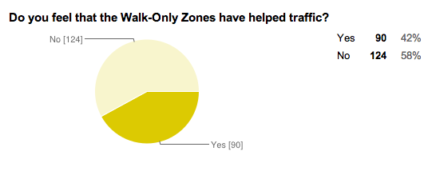
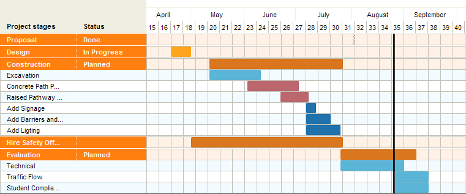

# The Case for Constructing Bike Lanes on the ASU Tempe Campus

Drew Watkins
Caitlyn Bedwell
Jamie Thomasian

## THE CURRENT SITUATION
Currently at ASU’s Tempe Campus, Undergraduate Student Government and the Office of the University Architect have implemented a system called "Walk Only Zones". These areas prohibit any non-pedestrian vehicular flow. At this time, the only walk only zone exists surrounding the Memorial Union, but two more phases are slated to follow.

According to the Walk Only Zone information website, walk.asu.edu, ASU feels that the walk only zones are the best proposal for creating better flow through campus. In the study from which the data for the walk only zones was pulled from, it stated that bike lanes would be an ineffective method of curbing traffic due to the high urban density of the Tempe campus. It also stated that walk only zones would do a better job than bike lanes because of too many intersections and pedestrian crossings on campus.

Though USG's points about the walk only zones may have some merits in certain areas of campus, such as directly north of the MU, we feel that their arguments did not effectively take into account how the walk only zones would reroute traffic, instead focusing only on the traffic patterns before the walk only zones were implemented. In personal interviews which we did with cyclists and pedestrians on campus, we found that oftentimes bike traffic would simply find another route around the walk only zones, causing more congestion in other areas of campus. In fact, in a survey we did regarding the success of the walk only zones, we found that only 42% of students felt that the walk only zones had improved pedestrian traffic patterns (n=214).

Another issue which the walk only coalition raised against putting bike lanes on campus is the high number of crossings which the bike lanes would cut across, leading to more accidents. Though it is in fact true that bike lanes would have to cover many intersections, their claim doesn’t take into account that those dangerous intersections already exist, for example at Palm Walk and Orange St. Not only that, but cyclists are unpredictable and ride out at random points into the intersection.

Moreover, the current phase of the walk only zones only addresses one highly congested area, Orange Mall by the MU Fountain. Even though it expands to other areas, such as Hayden lawn, it does not make any sense to restrict traffic there. Those areas have high visibility and enable traffic to flow in predictable patterns for the entire length of the lawn.

Finally,  walk-only zone study failed to address problem areas such as Palm Walk, which has very high traffic levels while covering too large an area to prevent wheeled traffic without severely impeding mobility and efficiency of transportation. We feel that for most areas, focusing on creating dedicated bike lanes as opposed to outright banning wheeled traffic is the best option to ease congestion on campus.

## PROPOSAL DETAILS
In our research, we have determined several options for rerouting traffic to avoid forcing cyclists to abandon efficient transportation while also easing congestion of pedestrians. In our first phase, we are proposing creating a bike lane which follows Palm walk. We have also identified several other areas which bike lanes would be favorable for diverting traffic from high-volume pedestrian zones, such as encouraging cyclists to follow the north and east sides of the Hayden Library building as opposed to cutting through Orange Mall by the MU.

For phase one of our plan, we propose the construction of bike lanes on the ASU Tempe campus to help ease congestion and improve safety for all commuters. Though the problem cannot be solved via one single solution, we aim to start with the creation of a mix of separated and integrated painted lanes along the North-to-South Palm Walk pathway. The bike lanes will span from the Sun Devil Fitness Complex on Apache Boulevard to the bridge on University Drive.

From South to North, our proposed solution is as follows:

**1.  SDFC to MU Access Road:** For the southernmost portion of our bike lane, we would like to create a semi-separated bike lane along Palm Walk. We propose adding five feet to the Western side of the walkway, painting the walkway green, and spacing posts along the length to serve as an extra separation between pedestrians and cyclists.
**2.  MU Access Road Crossing:** At the MU access road crossing, we propose creating an elevated crossing. There will also be flashing warning signs for cyclists to watch for pedestrians.
**3.  MU Access Road to Orange Mall:** From the access road to Orange Mall, we will be adding 10 feet to the Western side of the walkway and employing the same method of separation as the southernmost portion of the pathway.
**4.  Orange Mall Crossing:** Crossing Orange Mall is one of the highest danger areas along the route. This will start with rumble strips and a warning sign 5 feet out from the crossing. When actually crossing Orange Mall, we will employ the same method as before with the raised bike lane. Approaching from the South, the crossing will go from the newly built path to the access road to the West of Palm Walk.
**5.  Orange Mall to Cady Mall:** This section of the bike lane will consist of painting bike lanes on the service road to the West of Palm Walk. At the end of the service road, the bike lane will merge with a fully-separated bikeway along Palm Walk. This bikeway will be built to the West of Palm Walk and will be ten feet wide.
**6.  Cady Mall Crossing:** The crossing of Cady Mall is another very high traffic area. As the bikeway approaches the crossing, it will curve in towards the westernmost part of the intersection as to minimize the crossing distance. Again, we will revert to the raised crossing and the crossing lights visible from all directions. We will also employ traffic shaping measures to funnel pedestrians closer to the center of the mall. This will both help to increase alertness and visibility for all parties.
**7.  Cady Mall to University Bridge:** After the successful crossing of Cady Mall, the traffic flow significantly decreases. At this area, we are proposing a five foot path to the West of Palm Walk to facilitate Southern traffic flow and painting 5 feet of pavement along the existing walkway to facilitate northern traffic flow to the bridge.

In response to the walk-only coalition’s concerns about the danger of having bike lanes at major intersections, we found that the addition of bike lanes would actually serve to make those crossings more predictable by increasing visibility, not cause more traffic. By implementing measures such as slightly raising the pavement where these crossings take place and ensuring that bikes are always crossing at the same location as opposed to all along the road, it would help to make crossings safer.The lanes also have yield and stop signs at every intersection to keep the cyclists fully aware of pedestrians, and vice versa.

## SUPPORT
According to Tucson Velo, a news source based in Tucson that focuses on awareness and events concerning the biking community, the University of Arizona is in the process of creating contraflow bike lanes to help cyclists navigate on campus in a safer, more efficient manner. contraflow bike lanes flow the opposite way of the pedestrian paths surrounding. We feel that it would be beneficial to model our proposed solution after the University of Arizona.. The University of Arizona has about 10,000 fewer students than Arizona State University, yet we feel that if we were to add bike lanes it would have an even larger and more effective outcome; our campus is more congested and will greatly benefit from the addition.

Our proposal is to not only expand certain areas we feel receive the most biking traffic, but to segregate the areas for cyclists only using various signs and barriers. Based on the implementation at U of A, we feel that commuters would be quick to adjust to the changes. As one University of Arizona student, Abbey Johnson, stated, "The bike lanes were not even advertised, it just became apparent to students that these lanes were for cyclists".

## COSTS AND TIMELINE
According to Benefit-Cost Analysis of Bicycle Facilities, the proposed bike path will cost the university an estimated one time cost of $304,740 for a concrete path and will take three months to complete. The current solution, Walk Only Zones, are an annual expenditure that vastly outweigh our one-time cost solution. There are currently two Walk Only Ambassadors at each of the five entrances and three enforcers monitoring the entire zone for eight hours each day Monday through Friday for thirty weeks during the school year. Each worker is paid $10.20/hour for a total annual cost around $159,120. When the two future phases are complete this number will triple to an estimated $477,360 annually.

The university is emptiest in the summer months of May through August, and the project could easily be completed in that time. We would like to implement this project starting in 2015.

